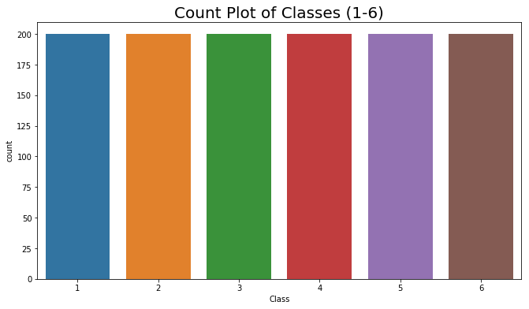
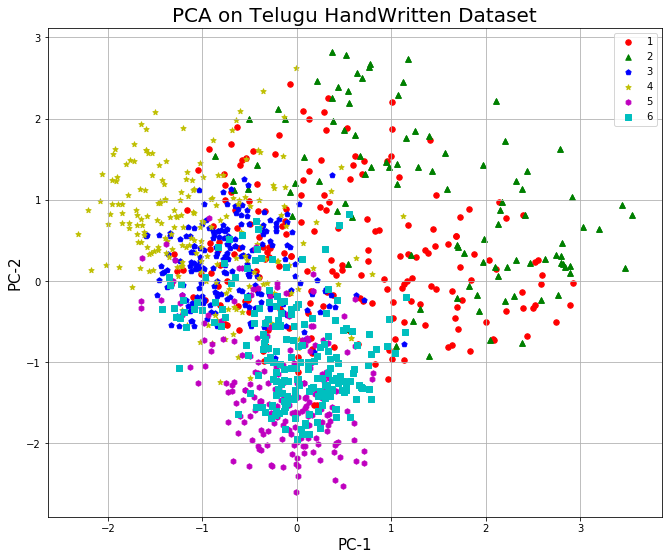

# Import Libraries


```python
import seaborn as sns
import matplotlib.pyplot as plt
import pandas  as pd

%matplotlib inline
```


```python
df = pd.read_csv('E://Telugu Character Recogniton//CSV_dataset//Reduced_CSV_datasetsix_vowel_dataset_with_class.csv')
```


```python
df.head()
```


<div>
<style scoped>
    .dataframe tbody tr th:only-of-type {
        vertical-align: middle;
    }

    .dataframe tbody tr th {
        vertical-align: top;
    }

    .dataframe thead th {
        text-align: right;
    }
</style>
<table border="1" class="dataframe">
  <thead>
    <tr style="text-align: right;">
      <th></th>
      <th>PC-1</th>
      <th>PC-2</th>
      <th>class</th>
    </tr>
  </thead>
  <tbody>
    <tr>
      <th>0</th>
      <td>-0.465195</td>
      <td>1.595832</td>
      <td>1</td>
    </tr>
    <tr>
      <th>1</th>
      <td>0.999757</td>
      <td>1.540998</td>
      <td>1</td>
    </tr>
    <tr>
      <th>2</th>
      <td>0.130561</td>
      <td>1.990142</td>
      <td>1</td>
    </tr>
    <tr>
      <th>3</th>
      <td>-0.185552</td>
      <td>1.794584</td>
      <td>1</td>
    </tr>
    <tr>
      <th>4</th>
      <td>1.078459</td>
      <td>1.282991</td>
      <td>1</td>
    </tr>
  </tbody>
</table>
</div>


* ## Count Plot of classes


```python
width = 11
height = 6
plt.figure(figsize=(width,height))
sns.countplot(x=df['class']);
plt.title('Count Plot of Classes (1-6)',size='20')
plt.xlabel('Class')
plt.show()
```





 ## Scatter plot 


```python
# Plotting pc1 & pc2
fig = plt.figure(figsize = (11,9))
ax = fig.add_subplot(1,1,1) 
ax.set_xlabel('PC-1', fontsize = 15)
ax.set_ylabel('PC-2', fontsize = 15)
ax.set_title('PCA on Telugu HandWritten Dataset', fontsize = 20)
targets = [1,2,3,4,5,6]
colors = ['r','g','b','y','m','c']
markers= ['o', '^', 'p', '*', 'h', 's']
for target, color, m in zip(targets,colors, markers):
    indicesToKeep = df['class'] == target
    ax.scatter(df.loc[indicesToKeep, 'PC-1']
               , df.loc[indicesToKeep, 'PC-2']
               , c = color
               , s = 30, marker= m)
ax.legend(targets)
ax.grid()
plt.show() # FOR SHOWING THE PLOT
```





```python

```
