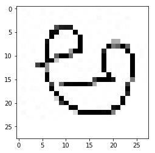
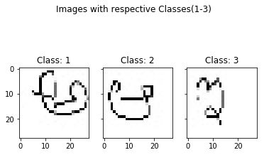
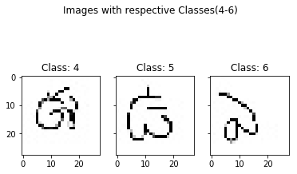

### Import Libraries


```python
import pandas as pd
import numpy
import matplotlib.pyplot as plt
%matplotlib inline
```

### Read the CSV file


```python
df = pd.read_csv("E://Telugu Character Recogniton//CSV_dataset//CSV_datasetsix_vowel_dataset_with_class.csv")

df.head()
```


<div>
<style scoped>
    .dataframe tbody tr th:only-of-type {
        vertical-align: middle;
    }

    .dataframe tbody tr th {
        vertical-align: top;
    }

    .dataframe thead th {
        text-align: right;
    }
</style>
<table border="1" class="dataframe">
  <thead>
    <tr style="text-align: right;">
      <th></th>
      <th>pixel0</th>
      <th>pixel1</th>
      <th>pixel2</th>
      <th>pixel3</th>
      <th>pixel4</th>
      <th>pixel5</th>
      <th>pixel6</th>
      <th>pixel7</th>
      <th>pixel8</th>
      <th>pixel9</th>
      <th>...</th>
      <th>pixel775</th>
      <th>pixel776</th>
      <th>pixel777</th>
      <th>pixel778</th>
      <th>pixel779</th>
      <th>pixel780</th>
      <th>pixel781</th>
      <th>pixel782</th>
      <th>pixel783</th>
      <th>class</th>
    </tr>
  </thead>
  <tbody>
    <tr>
      <th>0</th>
      <td>255</td>
      <td>255</td>
      <td>254</td>
      <td>255</td>
      <td>255</td>
      <td>255</td>
      <td>252</td>
      <td>255</td>
      <td>255</td>
      <td>255</td>
      <td>...</td>
      <td>255</td>
      <td>255</td>
      <td>255</td>
      <td>255</td>
      <td>255</td>
      <td>255</td>
      <td>255</td>
      <td>255</td>
      <td>255</td>
      <td>1</td>
    </tr>
    <tr>
      <th>1</th>
      <td>255</td>
      <td>255</td>
      <td>254</td>
      <td>255</td>
      <td>255</td>
      <td>254</td>
      <td>255</td>
      <td>255</td>
      <td>255</td>
      <td>255</td>
      <td>...</td>
      <td>255</td>
      <td>255</td>
      <td>255</td>
      <td>255</td>
      <td>255</td>
      <td>255</td>
      <td>255</td>
      <td>255</td>
      <td>255</td>
      <td>1</td>
    </tr>
    <tr>
      <th>2</th>
      <td>255</td>
      <td>254</td>
      <td>255</td>
      <td>255</td>
      <td>255</td>
      <td>255</td>
      <td>254</td>
      <td>255</td>
      <td>254</td>
      <td>255</td>
      <td>...</td>
      <td>255</td>
      <td>255</td>
      <td>255</td>
      <td>255</td>
      <td>255</td>
      <td>255</td>
      <td>255</td>
      <td>255</td>
      <td>255</td>
      <td>1</td>
    </tr>
    <tr>
      <th>3</th>
      <td>254</td>
      <td>255</td>
      <td>255</td>
      <td>255</td>
      <td>254</td>
      <td>255</td>
      <td>255</td>
      <td>255</td>
      <td>254</td>
      <td>255</td>
      <td>...</td>
      <td>255</td>
      <td>255</td>
      <td>255</td>
      <td>255</td>
      <td>255</td>
      <td>255</td>
      <td>255</td>
      <td>255</td>
      <td>255</td>
      <td>1</td>
    </tr>
    <tr>
      <th>4</th>
      <td>254</td>
      <td>255</td>
      <td>255</td>
      <td>253</td>
      <td>255</td>
      <td>255</td>
      <td>255</td>
      <td>254</td>
      <td>255</td>
      <td>255</td>
      <td>...</td>
      <td>255</td>
      <td>255</td>
      <td>255</td>
      <td>255</td>
      <td>255</td>
      <td>255</td>
      <td>255</td>
      <td>255</td>
      <td>255</td>
      <td>1</td>
    </tr>
  </tbody>
</table>
<p>5 rows × 785 columns</p>
</div>


```python
df.tail()
```


<div>
<style scoped>
    .dataframe tbody tr th:only-of-type {
        vertical-align: middle;
    }

    .dataframe tbody tr th {
        vertical-align: top;
    }

    .dataframe thead th {
        text-align: right;
    }
</style>
<table border="1" class="dataframe">
  <thead>
    <tr style="text-align: right;">
      <th></th>
      <th>pixel0</th>
      <th>pixel1</th>
      <th>pixel2</th>
      <th>pixel3</th>
      <th>pixel4</th>
      <th>pixel5</th>
      <th>pixel6</th>
      <th>pixel7</th>
      <th>pixel8</th>
      <th>pixel9</th>
      <th>...</th>
      <th>pixel775</th>
      <th>pixel776</th>
      <th>pixel777</th>
      <th>pixel778</th>
      <th>pixel779</th>
      <th>pixel780</th>
      <th>pixel781</th>
      <th>pixel782</th>
      <th>pixel783</th>
      <th>class</th>
    </tr>
  </thead>
  <tbody>
    <tr>
      <th>1195</th>
      <td>255</td>
      <td>255</td>
      <td>255</td>
      <td>255</td>
      <td>255</td>
      <td>255</td>
      <td>255</td>
      <td>255</td>
      <td>254</td>
      <td>255</td>
      <td>...</td>
      <td>255</td>
      <td>255</td>
      <td>255</td>
      <td>255</td>
      <td>255</td>
      <td>255</td>
      <td>255</td>
      <td>255</td>
      <td>255</td>
      <td>6</td>
    </tr>
    <tr>
      <th>1196</th>
      <td>255</td>
      <td>255</td>
      <td>255</td>
      <td>255</td>
      <td>255</td>
      <td>255</td>
      <td>255</td>
      <td>255</td>
      <td>255</td>
      <td>255</td>
      <td>...</td>
      <td>255</td>
      <td>255</td>
      <td>255</td>
      <td>255</td>
      <td>255</td>
      <td>255</td>
      <td>255</td>
      <td>255</td>
      <td>255</td>
      <td>6</td>
    </tr>
    <tr>
      <th>1197</th>
      <td>255</td>
      <td>255</td>
      <td>255</td>
      <td>255</td>
      <td>255</td>
      <td>255</td>
      <td>255</td>
      <td>255</td>
      <td>255</td>
      <td>255</td>
      <td>...</td>
      <td>255</td>
      <td>255</td>
      <td>255</td>
      <td>255</td>
      <td>255</td>
      <td>255</td>
      <td>255</td>
      <td>255</td>
      <td>255</td>
      <td>6</td>
    </tr>
    <tr>
      <th>1198</th>
      <td>255</td>
      <td>255</td>
      <td>255</td>
      <td>255</td>
      <td>255</td>
      <td>255</td>
      <td>255</td>
      <td>255</td>
      <td>254</td>
      <td>255</td>
      <td>...</td>
      <td>255</td>
      <td>255</td>
      <td>255</td>
      <td>255</td>
      <td>255</td>
      <td>255</td>
      <td>255</td>
      <td>255</td>
      <td>255</td>
      <td>6</td>
    </tr>
    <tr>
      <th>1199</th>
      <td>254</td>
      <td>255</td>
      <td>255</td>
      <td>255</td>
      <td>252</td>
      <td>254</td>
      <td>255</td>
      <td>254</td>
      <td>254</td>
      <td>254</td>
      <td>...</td>
      <td>255</td>
      <td>255</td>
      <td>255</td>
      <td>255</td>
      <td>255</td>
      <td>255</td>
      <td>255</td>
      <td>255</td>
      <td>255</td>
      <td>6</td>
    </tr>
  </tbody>
</table>
<p>5 rows × 785 columns</p>
</div>


```python

```

### Reading First instance


```python
df.iloc[2]

```


    pixel0      255
    pixel1      254
    pixel2      255
    pixel3      255
    pixel4      255
    pixel5      255
    pixel6      254
    pixel7      255
    pixel8      254
    pixel9      255
    pixel10     255
    pixel11     255
    pixel12     255
    pixel13     253
    pixel14     255
    pixel15     254
    pixel16     254
    pixel17     255
    pixel18     254
    pixel19     255
    pixel20     254
    pixel21     255
    pixel22     255
    pixel23     254
    pixel24     255
    pixel25     255
    pixel26     255
    pixel27     255
    pixel28     255
    pixel29     253
               ... 
    pixel755    255
    pixel756    255
    pixel757    255
    pixel758    255
    pixel759    255
    pixel760    255
    pixel761    255
    pixel762    255
    pixel763    255
    pixel764    255
    pixel765    255
    pixel766    255
    pixel767    255
    pixel768    255
    pixel769    255
    pixel770    255
    pixel771    255
    pixel772    255
    pixel773    255
    pixel774    255
    pixel775    255
    pixel776    255
    pixel777    255
    pixel778    255
    pixel779    255
    pixel780    255
    pixel781    255
    pixel782    255
    pixel783    255
    class         1
    Name: 2, Length: 785, dtype: int64


### Reshaping into 28X28 array


```python
pix=[]
for i in range(784):
    pix.append('pixel'+str(i))
features=pix
X = df.loc[:, features].values
y=df.loc[:,'class'].values
X[0]
```


    array([255, 255, 254, 255, 255, 255, 252, 255, 255, 255, 254, 255, 253,
           255, 255, 254, 253, 255, 255, 253, 255, 255, 255, 253, 255, 255,
           255, 255, 254, 255, 255, 254, 255, 255, 255, 254, 255, 255, 255,
           253, 255, 254, 254, 255, 255, 252, 255, 254, 254, 255, 253, 255,
           255, 255, 255, 255, 255, 255, 255, 255, 253, 253, 255, 254, 253,
           255, 252, 253, 255, 255, 253, 255, 255, 255, 255, 255, 255, 254,
           255, 250, 255, 255, 255, 255, 255, 253, 253, 255, 255, 255, 255,
           255, 255, 255, 255, 255, 252, 254, 252, 255, 255, 255, 254, 253,
           255, 253, 253, 255, 255, 255, 255, 255, 254, 255, 255, 252, 254,
           168,   1,   0,   0, 255, 255, 255, 255, 253, 255, 255, 255, 255,
           255, 254, 253, 255, 255, 253, 255, 255, 255, 255, 255, 251, 254,
           255, 114,   6, 255, 254,   4, 250, 255, 254, 255, 255, 251, 117,
           119, 251, 254, 255, 255, 253, 255, 254, 255, 255, 255, 255, 253,
           255, 255, 250,   1, 255, 250, 255, 255, 161, 255, 254, 252, 254,
             5,  39, 171,   1,   0, 255, 255, 255, 255, 255, 255, 255, 255,
           255, 255, 253, 255, 255,   1, 254, 255, 254, 254, 164, 253, 255,
           255, 254,   0, 253, 254, 255, 244,   0, 255, 255, 255, 255, 255,
           255, 255, 255, 255, 255, 254, 255, 201, 255, 254, 255,  95, 252,
           255, 255, 254,   3, 255, 254, 255, 254, 255,   1, 251, 255, 254,
           255, 255, 255, 255, 255, 255, 255, 254, 197, 253, 253, 255, 255,
             0, 253, 253, 253, 255,   0, 255, 255, 253, 255, 255, 196, 255,
           253, 255, 255, 255, 255, 255, 255, 255, 250, 255, 126, 255,   2,
             2,   0,  38, 255, 253, 255, 255,   0, 255, 255, 253, 255, 254,
           253, 255, 255, 252, 255, 255, 255, 255, 255, 254, 255, 254, 125,
           254, 254, 255, 255, 254, 254, 255, 253, 252,   2, 255, 253, 255,
           254, 254, 255, 252, 255, 255, 255, 255, 255, 255, 255, 255, 253,
           255, 126, 255, 251, 251, 254, 255, 253, 255, 255, 255, 215,   4,
           253, 255, 255, 255,  85, 253, 252, 254, 255, 255, 255, 255, 255,
           255, 255, 255, 254, 163, 255, 255, 255, 255,   0,   0,   0,   4,
             0,   0,   3, 250, 255, 255,   0, 255, 255, 255, 253, 255, 255,
           255, 255, 255, 255, 249, 255,   1, 251, 255, 253, 254, 254, 255,
           255, 251, 255, 255, 255, 255, 255, 255,   1, 254, 255, 251, 255,
           255, 255, 255, 255, 253, 255, 255, 254,   9, 254, 255, 254, 255,
           255, 255, 254, 255, 254, 254, 255, 253, 255, 237,  85, 255, 253,
           255, 254, 255, 255, 255, 255, 255, 255, 252, 255, 254,   2, 253,
           255, 253, 255, 253, 255, 255, 253, 255, 255, 255, 255,   0, 253,
           255, 255, 255, 253, 255, 255, 255, 255, 253, 253, 255, 255, 253,
           178,   0, 255, 255, 252, 255, 253, 252, 255, 253, 253, 255,   2,
           255, 255, 255, 252, 255, 255, 255, 255, 255, 255, 255, 255, 252,
           253, 255, 253,  14,   1,   0, 252, 255, 255, 255, 255, 254, 255,
             0, 132, 251, 254, 254, 255, 252, 255, 255, 255, 255, 255, 255,
           253, 255, 255, 255, 255, 254, 252, 254,  10,   1,   0,   0,   0,
             0,   5, 255, 255, 255, 255, 254, 253, 255, 253, 255, 255, 255,
           255, 254, 255, 251, 255, 255, 255, 252, 255, 255, 253, 255, 255,
           255, 255, 254, 254, 255, 253, 251, 255, 253, 255, 255, 253, 255,
           255, 255, 255, 254, 255, 255, 255, 255, 253, 255, 253, 252, 255,
           255, 255, 254, 254, 255, 254, 253, 255, 255, 252, 255, 255, 253,
           255, 255, 255, 255, 255, 254, 255, 255, 255, 255, 255, 252, 255,
           255, 252, 255, 253, 255, 253, 255, 255, 255, 255, 255, 255, 254,
           254, 253, 255, 255, 255, 255, 255, 255, 255, 255, 253, 253, 255,
           255, 255, 251, 255, 255, 254, 255, 255, 254, 255, 254, 255, 252,
           255, 254, 255, 255, 253, 255, 255, 255, 255, 255, 255, 255, 255,
           255, 255, 255, 255, 255, 255, 255, 255, 255, 255, 255, 255, 255,
           255, 255, 255, 255, 255, 255, 255, 255, 255, 255, 255, 255, 255,
           255, 255, 255, 255, 255, 255, 255, 255, 255, 255, 255, 255, 255,
           255, 255, 255, 255, 255, 255, 255, 255, 255, 255, 255, 255, 255,
           255, 255, 255, 255, 255, 255, 255, 255, 255, 255, 255, 255, 255,
           255, 255, 255, 255, 255, 255, 255, 255, 255, 255, 255, 255, 255,
           255, 255, 255, 255, 255, 255, 255, 255, 255, 255, 255, 255, 255,
           255, 255, 255, 255, 255, 255, 255, 255, 255, 255, 255, 255, 255,
           255, 255, 255, 255], dtype=int64)


```python
imarray = numpy.asfarray(X[11]).reshape((28,28))
```


```python
imarray
```


    array([[255., 252., 255., 255., 255., 252., 255., 255., 255., 255., 252.,
            255., 253., 255., 254., 255., 255., 252., 255., 254., 255., 255.,
            255., 254., 255., 255., 255., 255.],
           [255., 255., 252., 255., 255., 252., 255., 252., 255., 255., 255.,
            252., 255., 255., 254., 255., 255., 255., 255., 253., 254., 253.,
            255., 255., 255., 255., 255., 255.],
           [255., 254., 255., 254., 255., 255., 253., 255., 255., 252., 255.,
            255., 253., 255., 255., 255., 255., 250., 255., 255., 255., 255.,
            255., 250., 255., 255., 255., 255.],
           [254., 253., 255., 255., 255., 253., 255., 253., 255., 254., 255.,
            255., 254., 253., 255., 253., 253., 255., 255., 253., 255., 253.,
            254., 255., 255., 255., 255., 255.],
           [254., 255., 255., 254., 253., 255., 255., 254.,  74.,  31.,  26.,
             26., 255., 255., 254., 255., 255., 255., 255., 255., 255., 251.,
            255., 253., 255., 255., 255., 255.],
           [255., 253., 255., 255., 255., 252., 252.,   9.,   8., 253., 255.,
            255.,   0., 255., 253., 254., 255., 252., 255., 253., 255., 255.,
            255., 255., 255., 255., 255., 255.],
           [255., 254., 254., 254., 254., 255., 250.,   2., 255., 255., 250.,
            255., 255.,   0., 255., 253., 255., 255., 254., 255., 254., 255.,
            253., 253., 255., 255., 255., 255.],
           [254., 255., 254., 255., 255., 253.,  16., 252., 255., 255., 255.,
            255., 251.,   0., 255., 254., 255., 255., 254., 253., 172., 175.,
            253., 255., 255., 255., 255., 255.],
           [255., 253., 255., 254., 255., 253.,   4., 254., 255., 253., 255.,
            255., 255.,   1., 255., 254., 255., 253., 255.,   0., 122.,  96.,
              0., 101., 255., 253., 255., 253.],
           [255., 255., 255., 252., 255., 255.,   0., 255., 253., 255., 255.,
            155.,   2.,   1., 253., 255., 253., 255.,  37., 254., 251., 253.,
            255.,   3., 255., 255., 252., 255.],
           [255., 252., 255., 255., 255., 255.,   0., 255.,  93.,   0.,   1.,
            104., 255., 255., 255., 255., 255., 255.,   0., 255., 253., 255.,
            252., 253.,   0., 255., 252., 255.],
           [253., 255., 253., 255., 254., 254.,   3.,   0., 197., 252., 255.,
            255., 255., 250., 255., 253., 255., 253.,   0., 253., 255., 255.,
            254., 255.,   3., 252., 255., 255.],
           [255., 255., 255., 251.,  64.,   0., 147., 253., 255., 255., 251.,
            255., 253., 255., 255., 255., 253., 255.,   0., 253., 254., 253.,
            252., 255.,   1., 255., 254., 254.],
           [251., 253., 255., 255., 254., 255., 144., 254., 253., 255., 255.,
            255., 255., 252., 254., 252., 255., 253.,   0., 255., 255., 253.,
            255., 255.,   1., 254., 255., 254.],
           [255., 255., 254., 255., 255., 251.,   0., 255., 255., 255., 255.,
            255., 254., 255., 253., 255., 254., 255., 255.,   0., 252., 255.,
            253., 255.,   3., 253., 255., 255.],
           [255., 253., 255., 254., 254., 255.,   2., 252., 255., 255., 252.,
            255., 255., 252., 253., 254.,  67.,   0.,   0.,   0.,  22., 255.,
            255., 252., 122., 255., 255., 253.],
           [254., 255., 255., 254., 255., 254., 255.,  65., 255., 101.,   0.,
              5.,   0.,   0.,   0.,  23., 168., 251., 255., 252., 255., 255.,
            255.,  61., 255., 255., 255., 255.],
           [255., 252., 255., 252., 253., 255., 253.,   0., 253., 255., 255.,
            252., 251., 255., 255., 255., 252., 255., 254., 254., 255., 255.,
            249.,   2., 255., 255., 255., 255.],
           [255., 254., 255., 255., 255., 255., 255., 253.,   2., 253., 255.,
            255., 255., 253., 255., 253., 255., 255., 254., 255., 255., 254.,
            255.,  36., 255., 255., 255., 255.],
           [252., 255., 254., 253., 255., 255., 254., 254., 212.,   0., 255.,
            255., 254., 255., 253., 255., 254., 255., 254., 255., 255., 253.,
             12., 254., 255., 255., 255., 255.],
           [255., 250., 255., 254., 255., 253., 255., 255., 255.,  57.,   0.,
            254., 255., 255., 252., 255., 255., 254., 255., 253., 252., 254.,
              5., 255., 255., 255., 255., 255.],
           [255., 255., 255., 255., 251., 254., 254., 255., 254., 254., 255.,
              0.,  10., 255., 255., 254., 255., 250., 252., 255.,  17.,   2.,
            253., 254., 255., 255., 255., 255.],
           [255., 250., 255., 255., 255., 255., 255., 253., 255., 254., 253.,
            255., 221.,   4.,   3.,   0.,   0.,   3.,   8.,   1., 129., 254.,
            254., 255., 255., 255., 255., 255.],
           [255., 255., 253., 254., 255., 251., 255., 255., 254., 255., 255.,
            255., 255., 253., 255., 255., 255., 255., 253., 254., 255., 255.,
            255., 255., 255., 255., 255., 255.],
           [255., 255., 255., 255., 255., 255., 255., 255., 255., 255., 255.,
            255., 255., 255., 255., 255., 255., 255., 255., 255., 255., 255.,
            255., 255., 255., 255., 255., 255.],
           [255., 255., 255., 255., 255., 255., 255., 255., 255., 255., 255.,
            255., 255., 255., 255., 255., 255., 255., 255., 255., 255., 255.,
            255., 255., 255., 255., 255., 255.],
           [255., 255., 255., 255., 255., 255., 255., 255., 255., 255., 255.,
            255., 255., 255., 255., 255., 255., 255., 255., 255., 255., 255.,
            255., 255., 255., 255., 255., 255.],
           [255., 255., 255., 255., 255., 255., 255., 255., 255., 255., 255.,
            255., 255., 255., 255., 255., 255., 255., 255., 255., 255., 255.,
            255., 255., 255., 255., 255., 255.]])


### Plotting the reconstructed image


```python
print('After Converting values ie.., [0-255] in between [0-1] : ')
imarray=255-imarray
plt.imshow(imarray,cmap=plt.cm.binary);
# print(imarray)
```

    After Converting values ie.., [0-255] in between [0-1] : 
    


```python
# nimg = tf.keras.utils.normalize(imarray,axis=0)
nimg=imarray/255.0
print('After Converting values ie.., [0-255] in between [0-1] : ')
plt.imshow(nimg,cmap=plt.cm.binary);
```

    After Converting values ie.., [0-255] in between [0-1] : 
    





```python
def row2img(pos):
    return numpy.asfarray(X[pos]).reshape((28,28))

f, (ax1, ax2, ax3) = plt.subplots(1, 3, sharey=True)
f.suptitle("Images with respective Classes(1-3)")
ax1.set_title('Class: 1')
ax1.imshow(255-row2img(26),cmap=plt.cm.binary);
ax2.set_title('Class: 2')
ax2.imshow(255-row2img(222),cmap=plt.cm.binary);
ax3.set_title('Class: 3')
ax3.imshow(255-row2img(444),cmap=plt.cm.binary);

```





```python
f, (ax1, ax2, ax3) = plt.subplots(1, 3, sharey=True)
f.suptitle("Images with respective Classes(4-6)")
ax1.set_title('Class: 4')
ax1.imshow(255-row2img(666),cmap=plt.cm.binary);
ax2.set_title('Class: 5')
ax2.imshow(255-row2img(999),cmap=plt.cm.binary);
ax3.set_title('Class: 6')
ax3.imshow(255-row2img(1111),cmap=plt.cm.binary);
```





```python

```
